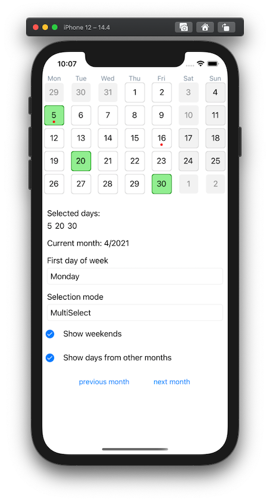
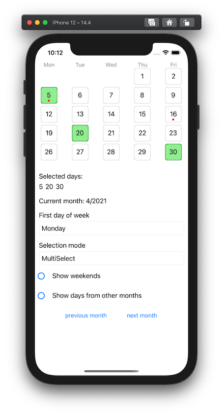
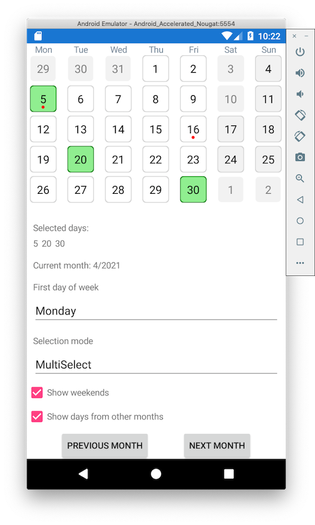
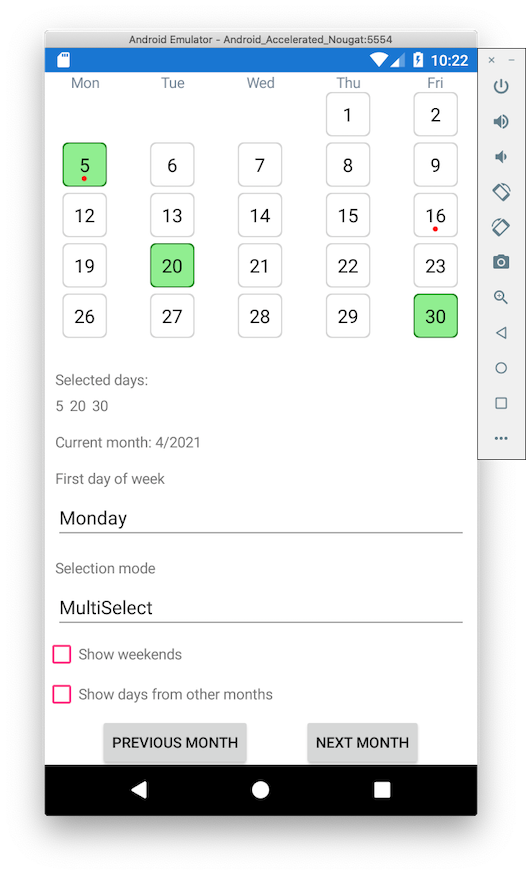

# Calendar control for XamarinForms

This repository contains CalendarControl with following features:
- customizing specific day with ControlTemplate
- customizing week day header with ControlTemplate
- single or multi select of days
- show / hide days from other months
- show / hide weekends
- select first day of a week

## Code

```xml
<components:CalendarControl x:Name="CalendarControl"
                            DayAdded="CalendarControl_OnDayAdded"
                            DayTapped="CalendarControl_OnDayTapped"
                            Date="01/01/21"
                            ShowWeekends="True"
                            ShowDaysFromOtherMonths="True"
                            FirstDayOfWeek="Sunday"
                            SelectionMode="SingleSelect"
                            DayControlTemplate="{StaticResource DayControlTemplate}"
                            WeekDayHeaderControlTemplate="{StaticResource WeekDayControlTemplate}" />
```

## Screenshots

### iOS




### Android


